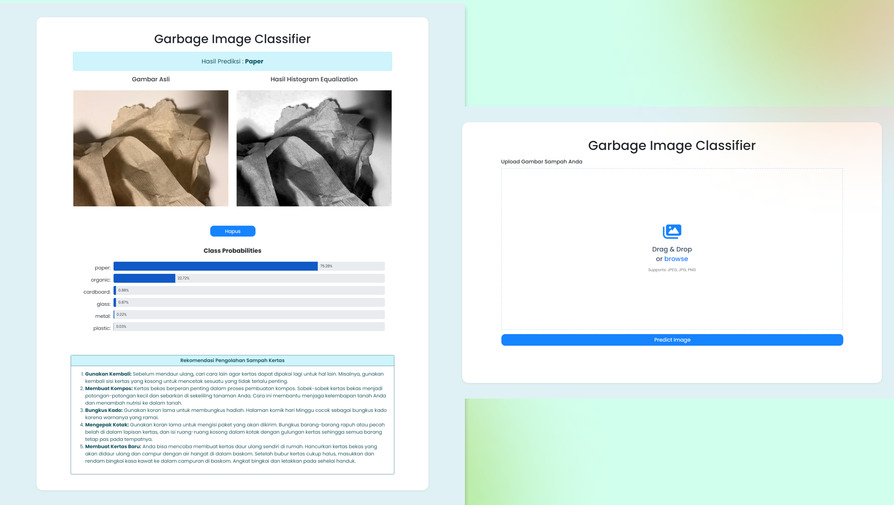

# ♻️ Waste Classification Web Service

Welcome to the **Waste Classification Web Service**! This project is a machine learning-based web service developed using TensorFlow to detect and classify different types of waste, including plastic, paper, organic, metal, glass, and cardboard.

## 🌟 Features

- **Waste Detection**: Automatically identifies the type of waste from an image.
- **TensorFlow Integration**: Utilizes powerful machine learning models for accurate classification.

## 🚀 Getting Started

### Prerequisites

Ensure you have the following installed:
- **Python** (version 3.7 or higher)
- **TensorFlow** (ensure it's installed in your Python environment)

### Installation
1. Clone the Repository**:
   ```bash
   git clone https://github.com/talithaalda/waste-classification-web-service.git
   cd waste-classification-web-service
   ```
2. Install Dependency
     ```bash
    pip install -r requirements.txt
     ```
3. Run Command
     ```bash
    py deploy.py   
     ```
   
